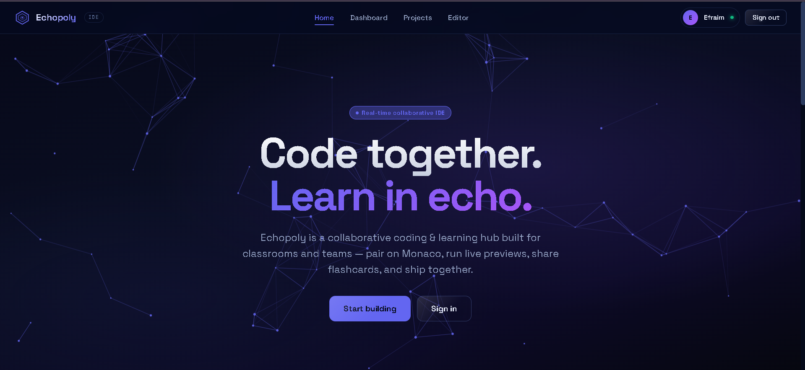
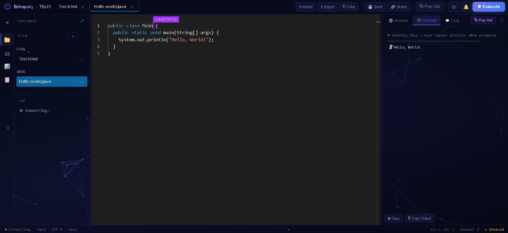

# EchoPoly IDE – Notes 📝

## Overview
EchoPoly IDE is a **web-based collaborative coding and learning platform** developed as part of my capstone project.  
It combines real-time code editing with classroom tools such as quizzes, activities, flashcards, and teacher supervision.  
The system integrates **anti-cheat detection**, **student monitoring**, and **activity creation** to support both coding practice and academic assessments.

---

## Features
- **Collaborative Editor** – Students can code together in real time, similar to Google Docs for programming.  
- **Teacher Supervision** – Teachers can create classes, unlock courses, and monitor student activity.  
- **Activities & Assessments** – Supports quizzes, exams, and coding activities with test cases and scoring.  
- **Anti-Cheat Logic** – Detects tab switching and idle time to ensure fair participation.  
- **Firebase Integration** – Firestore for data sync, Realtime Database for presence tracking, and Storage for custom resources (e.g., PDFs).

---

## Screenshots
### Homepage

### Editor Page

---

## Notes
- Built with **Monaco Editor** for code editing.  
- Uses **Firebase Blaze plan** for scalable Firestore and Storage.  
- Designed to be **desktop-first**, ensuring smooth classroom integration.  
- Future improvements: expand activity system, optimize supervision dashboard, and refine UI consistency.
