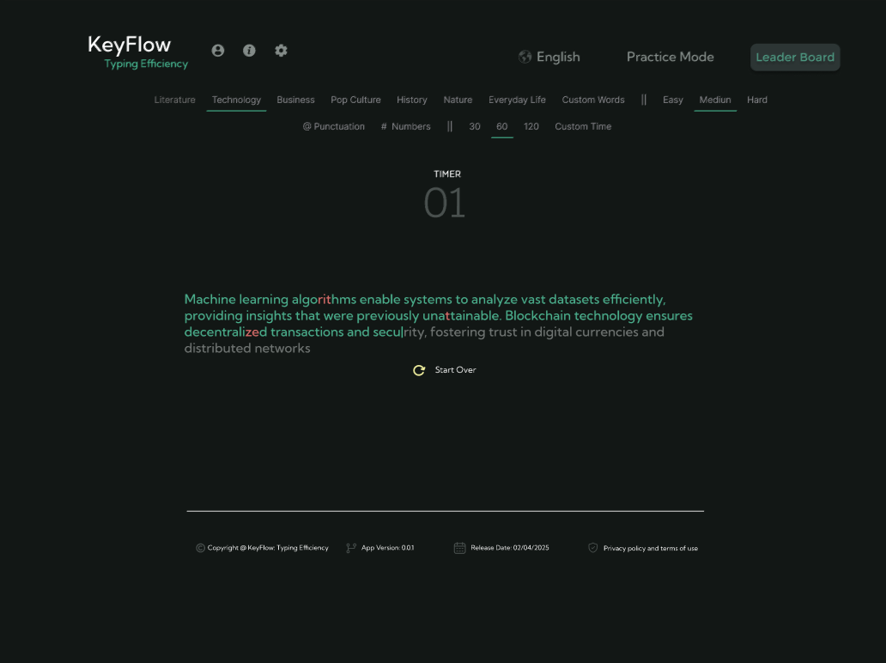
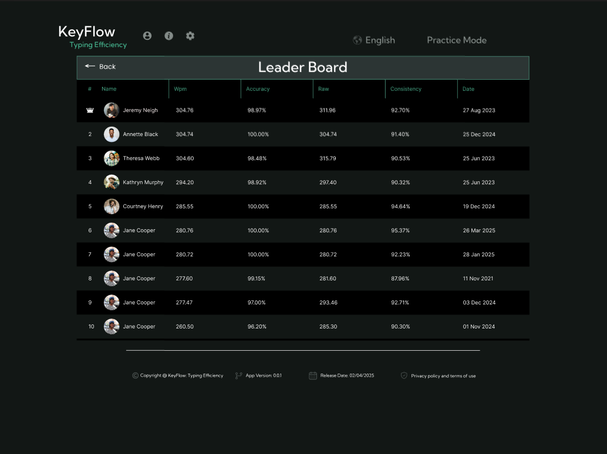

# KeyFlow: Typing Efficiency Program

## Overview
KeyFlow is a typing speed test game designed to help users improve their typing efficiency. It measures **Words Per Minute (WPM)**, accuracy, and tracks performance through a leaderboard system. The project was developed as part of a collaborative group effort, focusing on practical application of Object-Oriented Programming (OOP) principles.

## Objectives
- Provide an engaging way to practice typing speed and accuracy.
- Track user performance with real-time feedback.
- Display a leaderboard to encourage competition and improvement.

## Features
- **Homepage (Demo 1)**: Interactive speed typing interface where users type given sentences.
- **Leaderboard (Demo 2)**: Displays top scores, WPM, and accuracy for multiple players.
- **OOP Design**:
  - `Game` class manages flow and timing.
  - `Sentence` class provides randomized text prompts.
  - `Player` class calculates WPM, accuracy, and errors.

## Demo Screenshots
- 
- 

## Notes
- Built with Java and designed for extensibility.
- Future improvements may include difficulty levels, timed challenges, and persistent score storage.
