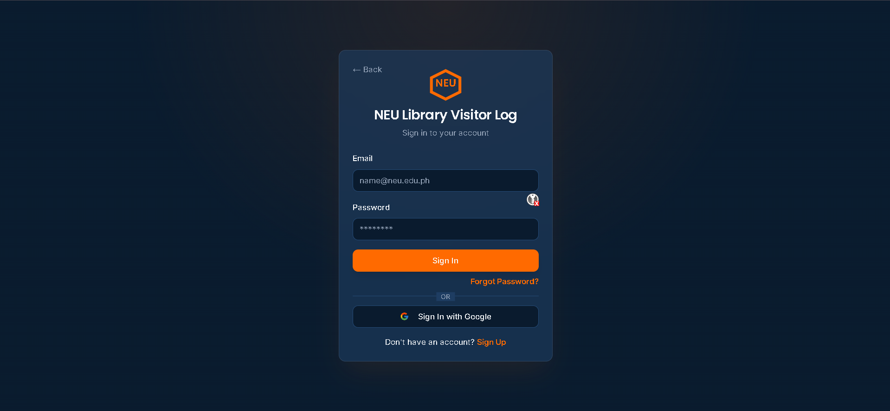
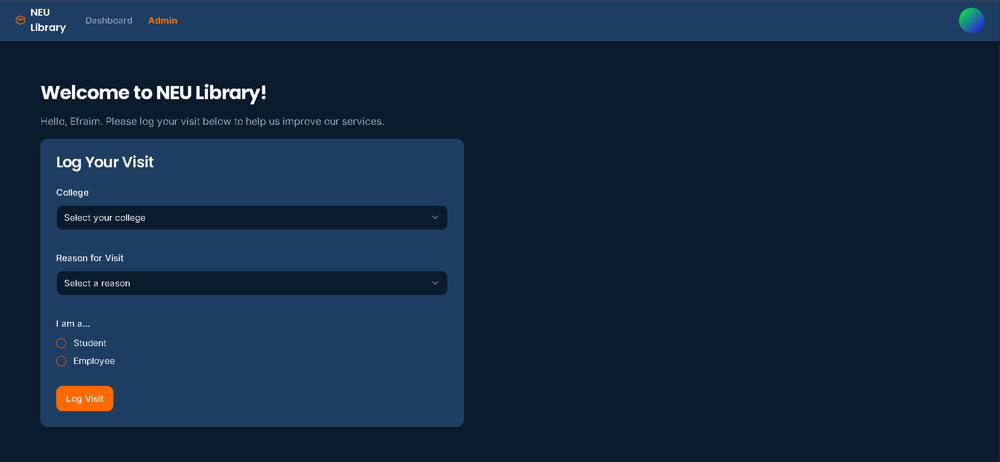

# NEU Library Visitor Log

## Overview
The **NEU Library Visitor Log** is a web-based system designed to record and analyze library visits at New Era University. It provides a secure, role-based interface for both regular users and administrators, ensuring efficient data collection and insightful visitor analytics.

## Objectives
- Allow users to log their library visits with details such as college, reason for visit, and role (student or employee).
- Enable administrators to view and filter visitor statistics by date range, reason, and college.
- Support Google account authentication for secure and convenient login.

## Features
- **Login Page (Screenshot 1)**: Users can sign in using their NEU Google account (`@neu.edu.ph`) for authentication.
- **Homepage (Screenshot 2)**: Displays a personalized greeting (“Welcome to NEU Library!”) and a form for logging visits.
- **Admin Dashboard**:
  - View visitor statistics by day, week, or custom date range.
  - Filter data by reason for visit, college, or employee status.
  - Statistics are displayed in dynamic cards for quick insights.

## Role-Based Access
- **Regular User** (`jcesperanza@neu.edu.ph`): Can log visits and view confirmation messages.
- **Admin** (`jcesperanza@neu.edu.ph`): Has access to analytics and filtering tools for visitor data.

## Technologies Used
- **Frontend**: React.js with modern UI components.
- **Backend**: Firebase for authentication and data storage.
- **Deployment**: Hosted on Vercel for live access.

## Demo Screenshots
- 
- 

## Notes
- Ensure Google login is functional for the provided test account.
- Role switching between user and admin is securely handled through Firebase authorization rules.
- Future improvements may include exporting visitor statistics and integrating attendance analytics.

